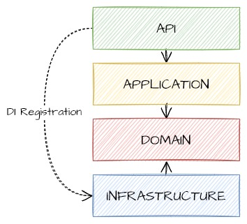

# Docosoft User Management Test Assignment
## Domain model class diagram

## Solution Architecture
Solution Architecture inspired by [Uncle Bob's Clean Atchitecture](https://blog.cleancoder.com/uncle-bob/2012/08/13/the-clean-architecture.html), with merged Use Cases and Interface Adapters layers.

## How to run
1. Pull repository
2. Run `docker compose build`
3. Run `docker compose up`
4. Browse http://localhost:5095/swagger